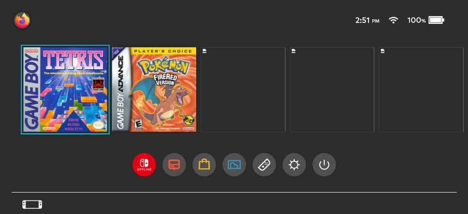

# Switch-Menu-Web
An interesting recreation of the switch's home page in a web browser

## What does it do?
Well it looks like the Switch's home menu! I had to make every image (except game covers), which took a while, but it looks good to me! 

It shows accurate time, and the profile in the top left actually shows you what browser you are using (but I only have images for Firefox, and chromium based browsers). It doesn't say on the site, but you can use the arrow keys to scroll left and right along the game carousel. Another thing is that I tried to get the battery to be slightly accurate, but apparently the way to detect it in javascript isn't supported at all on firefox, and it has low support with chrome (so I just gave up on that).

# What more will be added?
Well I am planning on making accurate recreations of other things as applications for this, such as the Sword and Shield Pokédex, and maybe a music player or something idk.
 
# theres an emulator?
The menu itself is not an emulator, or emulated at all, but I have included a slightly modified (only the css was modified) version of [BinBashBanana](https://github.com/BinBashBanana)'s [webretro](https://github.com/BinBashBanana/webretro), which is a port of retroarch to a browser. I am NOT including roms, so you will have to provide them yourself. it took me an annoying amount of time to figure out how to not count it when deciding the languages of this repo cause I do not want to claim [webretro](https://github.com/BinBashBanana/webretro) as my own.

## 
